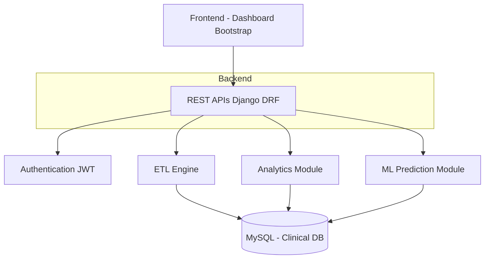

```mermaid
graph TD
    A[Frontend - Dashboard Bootstrap] --> B[REST APIs Django DRF]
    B --> C[Authentication JWT]
    B --> D[ETL Engine]
    B --> E[Analytics Module]
    B --> F[ML Prediction Module]
    D --> G[(MySQL - Clinical DB)]
    E --> G
    F --> G
    subgraph Backend
    B
    end
```
