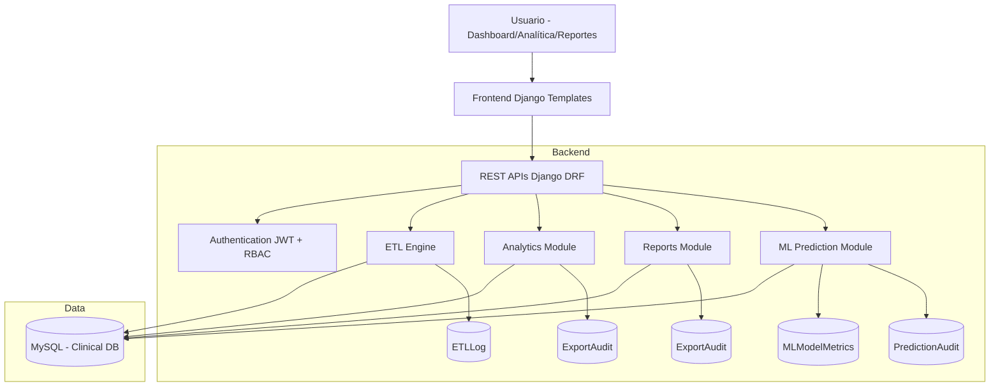

```mermaid
graph TD
    U[Usuario - Dashboard/Analítica/Reportes] --> F[Frontend Django Templates]
    F --> J[REST APIs Django DRF]
    J --> A[Authentication JWT + RBAC]
    J --> E[ETL Engine]
    J --> AN[Analytics Module]
    J --> R[Reports Module]
    J --> M[ML Prediction Module]

    E --> DB[(MySQL - Clinical DB)]
    AN --> DB
    R --> DB
    M --> DB

    E --> LOG[(ETLLog)]
    AN --> EXA[(ExportAudit)]
    R --> EXR[(ExportAudit)]
    M --> MLA[(MLModelMetrics)]
    M --> PA[(PredictionAudit)]

    subgraph Backend
        J
        A
        E
        AN
        R
        M
        LOG
        EXA
        EXR
        MLA
        PA
    end

    subgraph Data
        DB
    end
```
