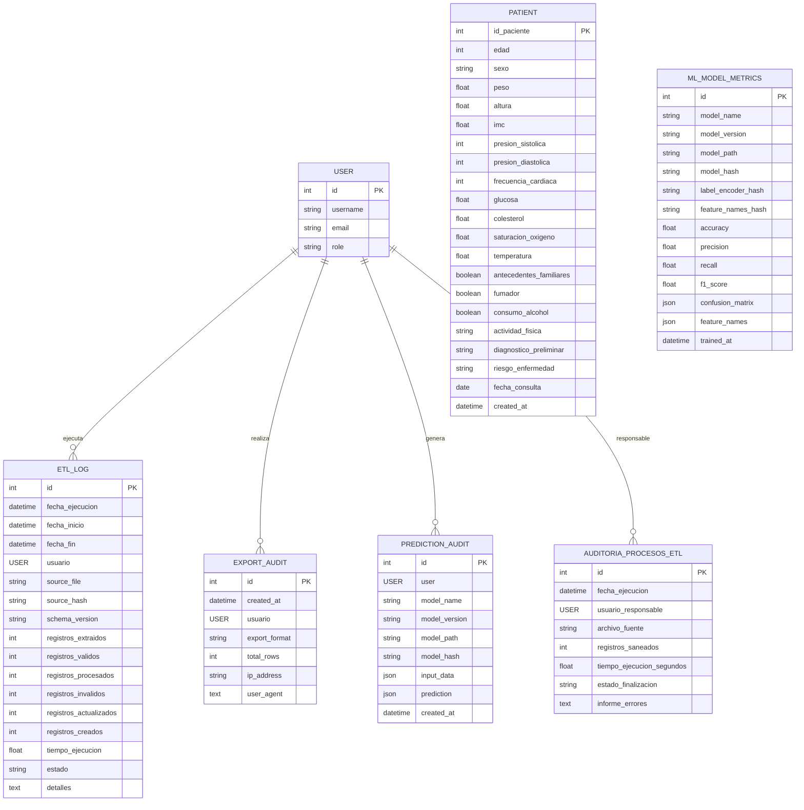

```mermaid
erDiagram
    USER {
        int id PK
        string username
        string email
        string role
    }

    PATIENT {
        int id_paciente PK
        int edad
        string sexo
        float peso
        float altura
        float imc
        int presion_sistolica
        int presion_diastolica
        int frecuencia_cardiaca
        float glucosa
        float colesterol
        float saturacion_oxigeno
        float temperatura
        boolean antecedentes_familiares
        boolean fumador
        boolean consumo_alcohol
        string actividad_fisica
        string diagnostico_preliminar
        string riesgo_enfermedad
        date fecha_consulta
        datetime created_at
    }

    ETL_LOG {
        int id PK
        datetime fecha_ejecucion
        datetime fecha_inicio
        datetime fecha_fin
        USER usuario
        string source_file
        string source_hash
        string schema_version
        int registros_extraidos
        int registros_validos
        int registros_procesados
        int registros_invalidos
        int registros_actualizados
        int registros_creados
        float tiempo_ejecucion
        string estado
        text detalles
    }

    EXPORT_AUDIT {
        int id PK
        datetime created_at
        USER usuario
        string export_format
        int total_rows
        string ip_address
        text user_agent
    }

    ML_MODEL_METRICS {
        int id PK
        string model_name
        string model_version
        string model_path
        string model_hash
        string label_encoder_hash
        string feature_names_hash
        float accuracy
        float precision
        float recall
        float f1_score
        json confusion_matrix
        json feature_names
        datetime trained_at
    }

    PREDICTION_AUDIT {
        int id PK
        USER user
        string model_name
        string model_version
        string model_path
        string model_hash
        json input_data
        json prediction
        datetime created_at
    }

    AUDITORIA_PROCESOS_ETL {
        int id PK
        datetime fecha_ejecucion
        USER usuario_responsable
        string archivo_fuente
        int registros_saneados
        float tiempo_ejecucion_segundos
        string estado_finalizacion
        text informe_errores
    }

    USER ||--o{ ETL_LOG : "ejecuta"
    USER ||--o{ EXPORT_AUDIT : "realiza"
    USER ||--o{ PREDICTION_AUDIT : "genera"
    USER ||--o{ AUDITORIA_PROCESOS_ETL : "responsable"
```
