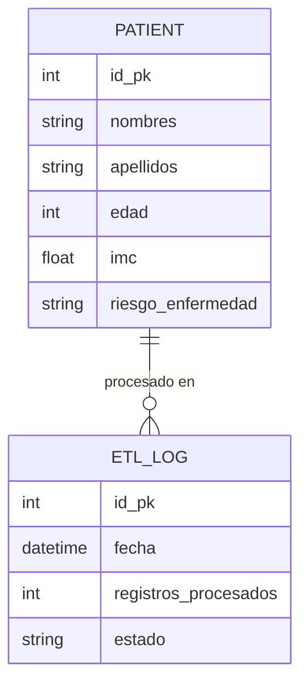

```mermaid
erDiagram
    PATIENT {
        int id_pk
        string nombres
        string apellidos
        int edad
        float imc
        string riesgo_enfermedad
    }
    ETL_LOG {
        int id_pk
        datetime fecha
        int registros_procesados
        string estado
    }
    PATIENT ||--o{ ETL_LOG : "procesado en"
```
