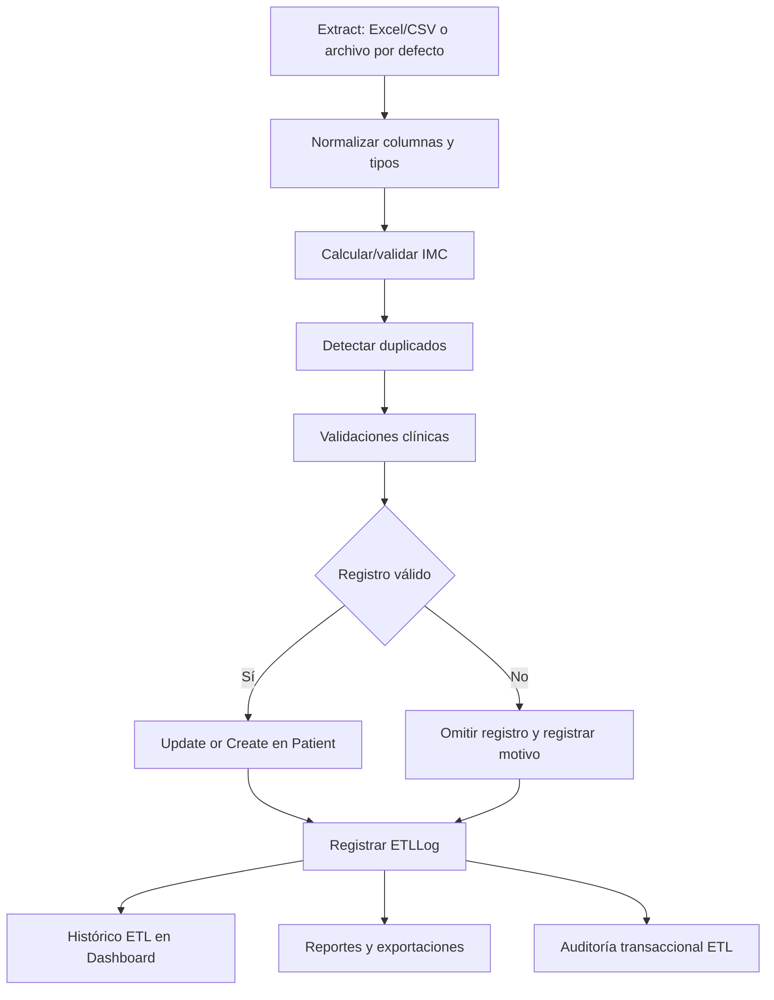

```mermaid
flowchart TD
    A[Extract: Excel/CSV o archivo por defecto] --> B[Normalizar columnas y tipos]
    B --> C[Calcular/validar IMC]
    C --> D[Detectar duplicados]
    D --> E[Validaciones clínicas]
    E --> F{Registro válido}
    F -->|Sí| G[Update or Create en Patient]
    F -->|No| H[Omitir registro y registrar motivo]
    G --> I[Registrar ETLLog]
    H --> I
    I --> J[Histórico ETL en Dashboard]
    I --> K[Reportes y exportaciones]
    I --> L[Auditoría transaccional ETL]
```
